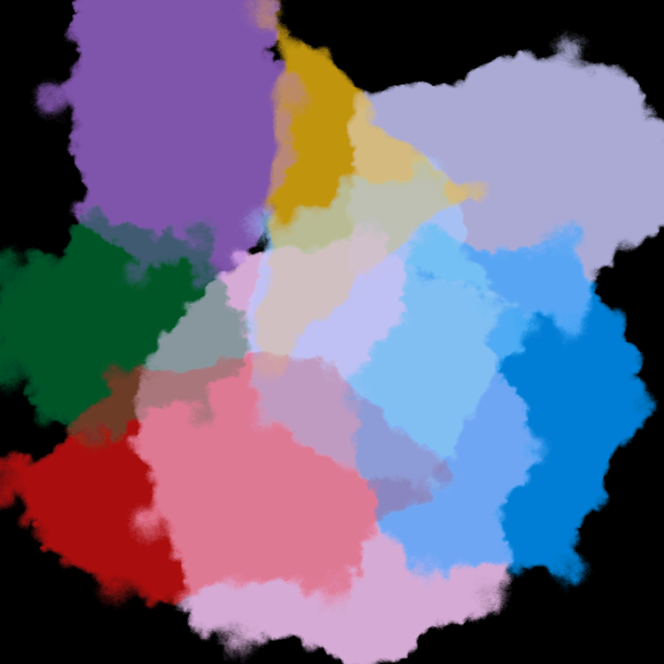
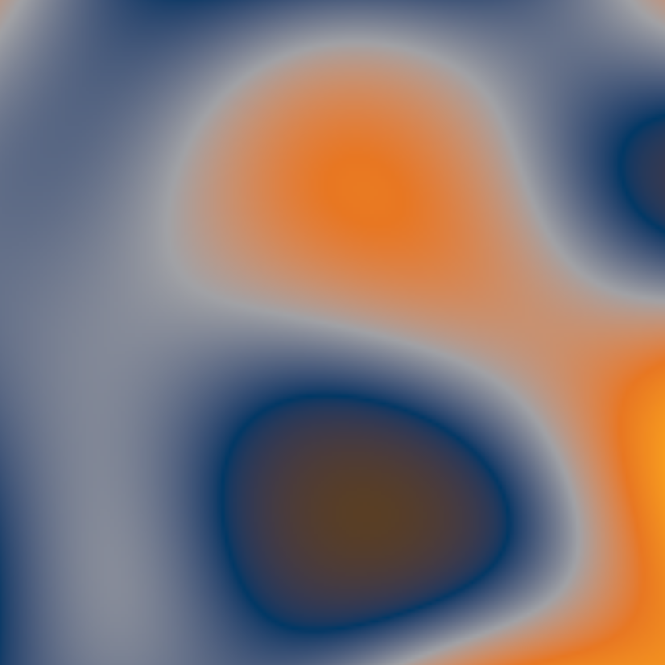
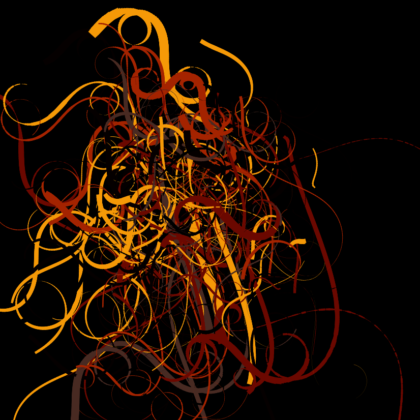

```{r setup, include=FALSE}
knitr::opts_chunk$set(echo = TRUE)
```


```{r, echo=FALSE}
library(ggplot2)
library(ggdensity)
data("iris")
iris = iris[complete.cases(iris), ]
attach(iris)
```

<style>
.flex-row {
  display: flex;
  gap: 20px;
  justify-content: center;
  align-items: flex-start;
  flex-wrap: wrap;
}
.flex-row img {
  width: 30%;
  height: auto;
  border-radius: 8px;
}
</style>

### GENERATIVE ART WORK

In this exercise we were required to create art of our choice using R. This was fascinating to me because I did not know R could do something like that. From left to right, the artwork is (1) Rastafari (2) BU Artwork and (3) Swirls.

<div class="flex-row">
  
  
  
</div>


### GGPLOT VISUALIZATIONS

A big part of this course was to analyze data and make meaningful visualizations to tell the stories from the data. In this part I will walk you through an example
of the visualizations we did.


```{r, echo=FALSE}
ggplot(iris, aes(x = Sepal.Length, y = Petal.Length, fill = Species)) +
  ggdensity::geom_hdr() +
  geom_point(shape = 21)
```
#### Does the growth of Sepal length affect the Petal length?
In this example, I was working with the iris dataset which gives the mesurements in centimeters of variables of 3 species of iris. Those are sepal length and width, and petal length and width. Particularly, in this visualization, I was investigating if the sepal length has any impact on the petal length. And from the observation, we can see that as the sepal length increases so does the petal length. 

```{r, echo=FALSE}
ggplot(iris, aes(x = Sepal.Length, y = Petal.Length, fill = Species)) +
  geom_hdr() +
  geom_point(shape = 21) +
  facet_wrap(vars(Species)) +
  scale_fill_brewer(palette="Dark2")
```

However, there is an exception seen in the `setosa` species which indicates that the sepal growth is not as impactful as in other species. This is what the facets help us to visualize. 


### INTRO STATS DASHBOARD

To demonstrate our understanding of the introductory statistics concepts, we were asked to make a dashboard for students taking intro stats to help solidify the concepts accompanied by visualizations. My group worked on helping students understand better the concept of sampling distribution. This is a concept that I myself struggled with at first. Understanding that the distribution comes from a statistic computed from many samples of the same size. 

<iframe src="https://abby-flynt.shinyapps.io/SamplingDistributions_Dashboard_Team4/" class="l-screen-inset shaded" height=1000px"></iframe>


### MORE VISUALIZATIONS

In this section, I will show 2 distributions from concepts that were new to me or intersting. 

#### 1. BOOTSTRAPING DISTRIBUTION

`Bootstrapping` is a resampling method that allows us to estimate the sampling distribution of a statistic when we don not have enough information or do not want to assume anything about the population distribution. 

To me this was fascinating. I did not know that it is possible to infer a statistic with only one good sample representation of the population.

```{r, echo=FALSE}
set.seed(230)
og_sample = rgamma(100, 2, 4)

library(ggplot2)
ggplot() + 
  geom_histogram(aes(x = og_sample, y = after_stat(density)), bins = 25, 
                 fill = "#E87722", alpha = .75) + 
  geom_density(aes(x = og_sample), col = "#003865") +
  geom_vline(xintercept = mean(og_sample), col = "#003865") +
  xlab("Sample Values") +
  ggtitle("Distribution of the Original Sample")
```


Here, we have a gamma distribution as our pupulation distribution. To build a bootstrap distribution, we need to resample with `replacement` to get different samples.
We take 10000 samples of the same size to build a bootstrap distribution. 

```{r, echo=FALSE}
boot.mean = NULL

for (b in 1:10000) {
  resamp = sample(og_sample, length(og_sample), replace = TRUE)
  boot.mean[b] = mean(resamp)
}


ggplot() + 
  geom_histogram(aes(x = boot.mean, y = after_stat(density)), bins = 25, 
                 fill = "#E87722", alpha = .75) + 
  geom_density(aes(x = boot.mean), col = "#003865") +
  geom_vline(xintercept = mean(og_sample), col = "#003865") +
  xlab("Bootstrap Mean Values") +
  ggtitle("Bootstrap Distribution for the Mean")
```


#### 2. GG-HALVES

The gg-halves plot is one that fascinated me throughout the semester. A gg-halves plot is a plot that has two sides each with a different shape. This is done to tell a story in two different perspectives. In the following visualization, I used `mtcars` dataset and used horsepower, cylinders and transmission. 


```{r, echo=FALSE}
library(gghalves)
data("mtcars")
mtcars = mtcars[complete.cases(mtcars), ]
attach(mtcars)
mtcars$cyl = factor(cyl, ordered = TRUE)
mtcars$am = factor(am, labels = c("automatic", "manual"))
```


```{r, echo=FALSE}
ggplot() +
   geom_half_violin(data = mtcars, aes(x = cyl, y = hp, split = am, fill = am), 
                    position = "identity") +
  labs(fill = "Transmission") +
  ggtitle("Car Data")
```

Here, we can see each violin plot for both automatic and manual being shown above, and it makes for an easy comparision between the two. Fairly quickly, we can see how cars with 8 cylinders vary a lot in horsepower with whether they're automatic or a manual.

